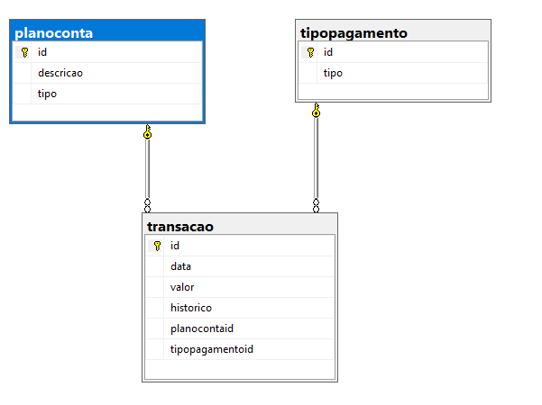
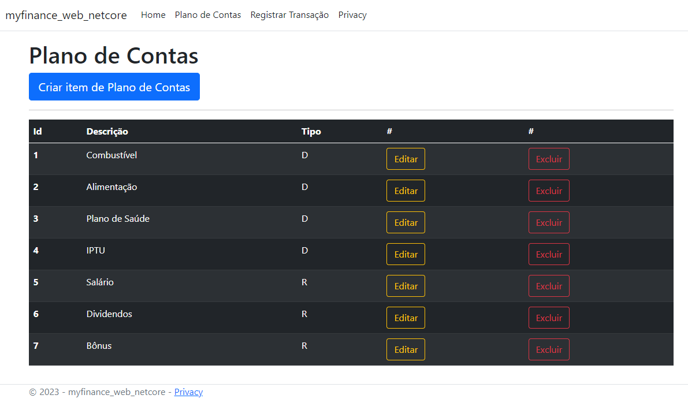
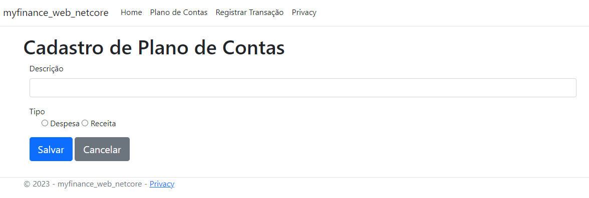
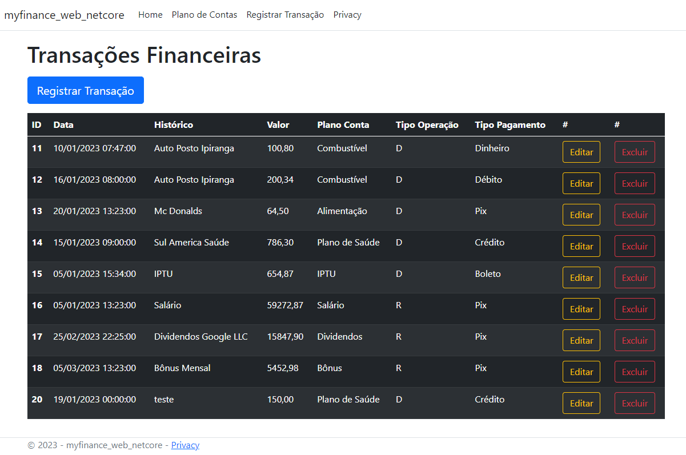
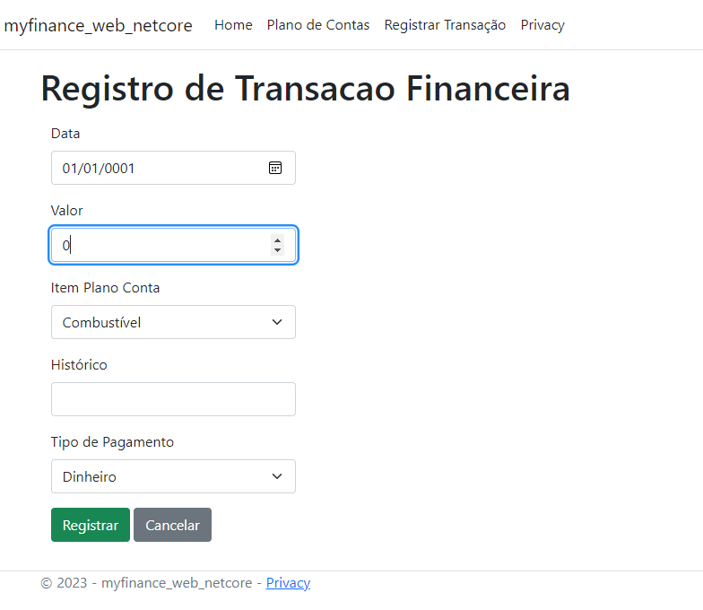

# MyFinance Web - Controle de Finanças Pessoais

## DER - Diagrama de Entidade e Relacionamento

 

## Protótipo - Funcionalidades
### Plano Conta
Tela com a listagem dos tipos de conta com botões para criar novas contas, editar e remover contas existentes.

 

#### Cadastro e Edição de Planos de Conta
Tela para realizar o cadastro/edição dos planos de conta.

 

### Transações
Tela com a listagem das transações com botões para criar novas transações, editar e remover transações existentes.

 

#### Criação e Edição de Transações
Tela para realizar o cadastro/edição das transações.

 

## Tecnologias
- Microsoft SQL
- .NET Core 7
- HTML 5 / CSS

 

## Comandos Úteis
A aplicação está dentro da pasta src, para rodar a aplicação utilize o comando :

- `dotnet build` - build da aplicação
- `dotnet run` - para rodar
- `dotnet watch run` - rodar com live update

 

## Contribuições

1. Fork this repository.
2. Create a branch: `git checkout -b <branch_name>`.
3. Make your changes and confirm them: `git commit -m '<commit_message>'`
4. Send to original branch: `git push origin <project_name> / <local>`
5. Create pull request.
